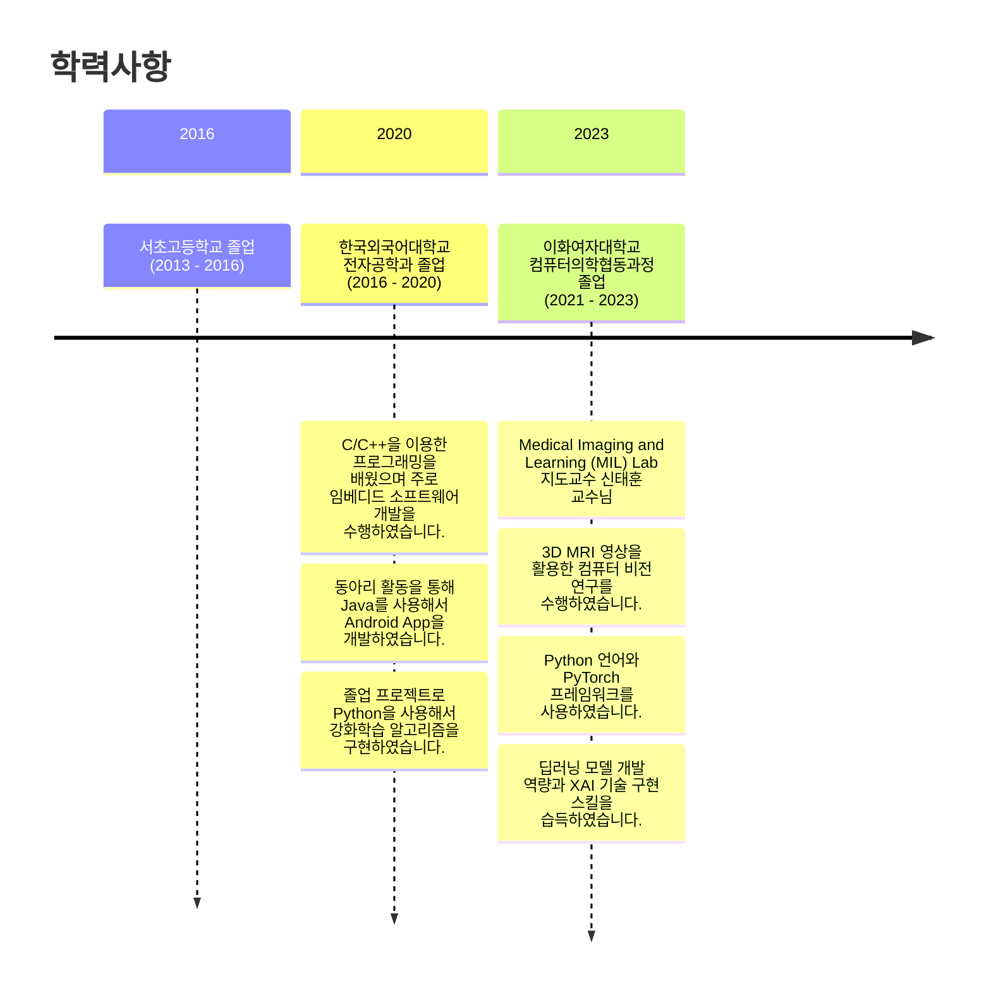

# 장혜정 (Hei-Jung Jang)

> 안녕하세요, 주어진 일에 책임을 다하는 연구원 장혜정입니다.
> 저는 주변 사람들로부터 차분하다는 평가를 받고 있습니다. 또한 맡은 일은 끝까지 해보자는 마인드를 가지고 있습니다.
> 이러한 제 가치관과 차분한 성격을 바탕으로 주어진 일에서 어려움을 겪더라도, 일단 몰두해서 책임을 다하고자 노력하는 편입니다.

[Contact Me📩](mailto:wkdgpwjd007@naver.com)

<body>
  Here is a mermaid diagram:
  <pre class="mermaid">
    timeline
            title 학력사항
            section 2016
              서초고등학교 졸업 (2013 - 2016)
            section 2020
              한국외국어대학교 전자공학과 졸업 (2016 - 2020) : C/C++을 이용한 프로그래밍을 배웠으며 주로 임베디드 소프트웨어 개발을 수행하였습니다. : 동아리 활동을 통해 Java를 사용해서 Android App을 개발하였습니다. : 졸업 프로젝트로 Python을 사용해서 강화학습 알고리즘을 구현하였습니다.
            section 2023
              이화여자대학교 컴퓨터의학협동과정 졸업 (2021 - 2023) : Medical Imaging and Learning (MIL) Lab 지도교수 신태훈 교수님 : 3D MRI 영상을 활용한 컴퓨터 비전 연구를 수행하였습니다. : Python 언어와 PyTorch 프레임워크를 사용하였습니다. : 딥러닝 모델 개발 역량과 XAI 기술 구현 스킬을 습득하였습니다.
  </pre>
</body>

## PROJECTS & EXPERIENCES

<!-- - 2020, worked on a Web HMI project as a front end developer (business project)  -->
<!-- - 2019, studied deep learning with breast cancer dataset and Python  -->
<!-- - 2018, designed an amplifier circuit using BJT  -->
- 2021, \[Graduate Research\] Deep learning based white matter hyperintensity volume prediction
- 2021, \[Datathon\] [Heart Disease AI Datathon 2021](https://github.com/hei-jung/HDAI-2021-ECG.git) 
- 2020, \[Playdata mini project no.5\] [Python application for the visually impaired](https://github.com/hei-jung/Seesun) 
- 2020, \[Playdata mini project no.4\] [Machine Learning based Pokédex](https://github.com/hei-jung/PokeDex) 
- 2020, \[Playdata mini project no.3\] [Machine Learning based attendance application](https://github.com/hei-jung/MiniProject_OpenCV) 
- 2020, \[Playdata mini project no.2\] [IoT CatchMind game](https://github.com/hei-jung/catchmind_game) 
- 2020, \[Playdata mini project no.1\] [Java Food Order System](https://github.com/hei-jung/myDbApp) 
- 2019, \[Undergraduate Research\] Study on 5G communication system and deep reinforcement learning with Python 
- 2019, \[Extracurricular Activity\] Teamwork in developing Android app for the student cafeteria with Android Studio 
- 2019, \[Undergraduate Assignment\] [Verilog HDL digital clock project](https://github.com/hei-jung/digitalClockHDL) 
- 2018, \[Undergraduate Assignment\] Teamwork in developing [IoT](https://github.com/hei-jung/LedControl_arduino) [Android app](https://github.com/hei-jung/LedControl) 
- 2018, \[Extracurricular Activity\] Teamwork in developing Android app which provides food recipes 
- 2017, \[Undergraduate Assignment\] Teamwork in designing a simple CPU circuit 
- 2016, \[Undergraduate Assignment\] Teamwork in programming [a simple game using C](https://github.com/hei-jung/teamproject_heaven)

## SKILLS

### Computer Skills

|   |Name|
|---|----|
|OS| |
|Languages|/  |
|Databases||
|ML/CV Frameworks| |
|Backend||
|Frontend||
|Other| |

<!-- - `OrCad` `MultiSim` `ModelSim` -->

|   |National Technical Qualification(국가기술자격증)|
|---|--------------------------------|
|2021.06.02|Engineer Information Processing(정보처리기사)|

### Language Skills

<!-- - Korean: native
- English: fluent / highly proficient
- Japanese: conversational / proficient -->

|   |Certificated Language Proficiency|Score/Level|
|---|---------------------------------|-----|
|2023.03|TOEIC Speaking|160(AL)|
|2022.08|TOEIC|915|
|2018.08|JLPT|N2|

## EXTRACURRICULAR ACTIVITIES

- 2020 Completed Embedded & AI Video Analytics Convergence SW Development Course in PlayData, EnCore Education Center
- 2019 Member of HUFS Software Club GnuVill
- 2019 Completed IDEC HDL Application & Design Education
- 2018 Completed Drone Control & Development Course
- 2018 6th Year Member of IT Club CADI
- 2018 Cultural Exchange Program in Tokyo, Japan
<!-- - 2017 Math Tutor Volunteering -->
<!-- - 2016 Member of HUFS Dept. of EE Student Council -->
